<div align="center">


# FirstPlayable

*Choose the influences. Play the consequences.*

<a href="https://firstplayable.vercel.app/difference"></a>

[](https://firstplayable.vercel.app)
[](https://firstplayable.vercel.app/difference)
[](https://firstplayable.vercel.app/studio)
[](https://qloo.devpost.com/)

[](https://firstplayable.vercel.app)
[](#commands)
[](#commands)
[](https://github.com/Asembris/FirstPlayable/actions/workflows/ci.yml)
[](.nvmrc)
[](LICENSE)

</div>

A playable-pitch studio. The authoritative specification is
[`docs/FIRSTPLAYABLE_BUILD_SPEC.md`](docs/FIRSTPLAYABLE_BUILD_SPEC.md); the
build state and verification record is
[`docs/BUILD_STATUS.md`](docs/BUILD_STATUS.md), the external-account evidence
is [`docs/DEPLOYMENT_PREFLIGHT.md`](docs/DEPLOYMENT_PREFLIGHT.md), the Qloo
and influence-approval evidence is
[`docs/PHASE3_QLOO_EVIDENCE.md`](docs/PHASE3_QLOO_EVIDENCE.md), and the
compilation evidence — including every failed attempt — is
[`docs/PHASE4_EVIDENCE.md`](docs/PHASE4_EVIDENCE.md).

**Phases 1, 2, 3, 4 and 5 are complete**, and the Phase 5 build is deployed to
production at <https://firstplayable.vercel.app>. This repository contains the
shared scene contract, the pure deterministic scene engine, hand-authored
design fixtures, one offline vertical slice at `/example`, a persistent
owner-scoped application shell on Supabase Postgres deployed on Vercel, the
real cultural-influence workflow, the compilation of approved influences into a
validated playable scene, and targeted revision, version-pinned read-only
share links, and offline HTML export.

A creator searches for an artist, confirms the identity explicitly, retrieves
real Qloo movie and videogame references, reads bounded model-proposed
interactions, and approves, edits, dismisses, or replaces them. Then they press
**Build the playable scene**, and the approved influences — and only those —
are compiled into a scene they review and explicitly activate.

### How a scene is compiled

**The base is deterministic.** Every mechanical element of the one-room
foundation is fixed by the product contract: the state variables, the six
action ids with their verbs, targets and availability conditions, the one
branch per action with its effects and ending binding, the three endings, and
the attachment ports. The server constructs all of it from the frozen brief.
The model supplies the title, the labels, the dialogue, and the ending text,
and has no field in which to put anything else.

**A module's mechanics are model-selected but server-wired.** An approved
influence becomes one to three *mechanics*. The model decides how many, whether
each is an `inspect` or an `ask`, which base action each one earns the right to
take — the commitment slot genuinely chooses between `core.ask_terms` and
`core.withhold` — whether a mechanic also adds a line on its slot's effect
port, whether its flag is shown to the player, and all of the copy. The server
writes the wiring: the identifiers, the flag and its initial value, the
condition that offers the action only while that flag is false, the effect that
sets it, the single branch, the gate that blocks the earned action until the
flag is true, and the port it attaches to. A module therefore cannot write the
foundation's state, read the other slot's, end the scene, or attach to a port
that is not its own — not as a rejected value but as one it has nowhere to
express.

Both stages get one initial attempt and at most one repair, and the Phase 1
validator — unchanged by Phase 4 — decides every candidate. A rejected
candidate lives only in a bounded operation artifact; only a validated scene
becomes a version, which the database enforces as well as the application.

**Review and activation are explicit.** A finished build is *pending*: it is
playable in the browser for review, and nothing becomes current until the
creator confirms it. Declining a review, or a later failed build, leaves the
previously active version active and playable.

**Gameplay after generation is local.** A complete playthrough, every ending,
and a reset make **zero** requests — no model call, no Qloo call, no database
read. The scene is a value the browser already holds, replayed by the same
deterministic engine the tests and `/example` run.

The chain a creator can inspect is **Qloo retrieved → FirstPlayable proposed →
Creator approved → Scene changed**. The fourth step is rendered only from a
mechanical witness computed on the stored version, so nothing can claim a
mechanical consequence that no compiler produced.

### Revision, sharing, and export (Phase 5)

**Revision is targeted.** A creator can edit one approved interpretation,
replace one influence, or remove one. An edit or a replacement recompiles only
its own slot; a removal costs no provider call at all. An ending's wording is
previewed with one text-only call and changes nothing until the creator applies
exactly the previewed text. Every revision is a new immutable version linked to
its parent, labelled `mechanical` or `wording`, with a stored diff that equals
the engine's own recomputation from the two stored scenes. Earlier versions
stay listed and playable.

**A share link names one version and can be withdrawn.** Publishing is
previewed first and returns a read-only link pinned to the version it was made
from. The public payload is a whitelisted snapshot that carries no project id,
premise, artist, owner cookie, capture, entity id, or unapproved idea. Revoking
takes effect on the next read, which is then indistinguishable from an unknown
link.

**An export is one self-contained HTML file** for the owner only. It plays from
`file://` with the network blocked and makes no request of any kind.

**Not built, and not claimed:** the model-selected comparator and the canonical
judge experience. Those are Phase 6, which has not started.

**Not claimed about Qloo:** that it recommended a mechanic, rated a reference,
or knows a creator's taste. Returned affinity is kept private and is never
shown as creative confidence. The influence isolation guarantee is dataflow and
ownership isolation, not a claim about what a language model could
independently invent.

Running the engine, `/example`, the unit tests, the browser tests, and the
production build requires **no account, no credential, and no network access**.
Only the persistent studio and the opt-in live commands need configuration.

## Requirements

Node `22.22.0` (see `.nvmrc`; `engines` requires `>=22.12.0`). Dependencies are
pinned exactly in `package.json` and locked by `package-lock.json`.

Copy [`.env.example`](.env.example) to `.env` for the persistent studio. Every
variable there is **server only**: there is no `NEXT_PUBLIC_` variable in this
repository and the browser never connects to Supabase directly.

| Variable | Needed for |
|---|---|
| `SUPABASE_URL`, `SUPABASE_SECRET_KEY` | the persistent studio and `npm run smoke:supabase` |
| `SUPABASE_ACCESS_TOKEN` | the Supabase CLI only; never read by the application |
| `QLOO_API_KEY`, `QLOO_API_BASE_URL` | artist search and the two first-hop reference requests |
| `OPENAI_API_KEY`, `OPENAI_CHAT_MODEL` | the bounded proposal stage and the base and module compilation stages |
| `QLOO_*` safety knobs (optional) | tighten the launch gap, the lease ceiling, or the local allowance |
| `MODEL_COST_CAP_MICROS` (optional) | lower the cumulative OpenAI spend cap below its compiled-in $0.60 |

## Commands

| Command | What it does |
|---|---|
| `npm run dev` | Start the local development server (`/example` plays with no configuration). |
| `npm run build` | Production build. Needs no database. |
| `npm start` | Serve the production build. |
| `npm run typecheck` | `tsc --noEmit` over the whole repository. |
| `npm test` | Vitest: contracts, engine, sessions, ownership, route security, operations, the spend budget, model adapter, Qloo normalization and transport, cache and launch policy, the proposal boundary, creator decisions, influence isolation, the base and module compilers, the bounded controller, scene versions, the committed SQL surface, secrets. Offline. |
| `npm run test:e2e` | Playwright: play, reset, version switch, the honest database-outage state, the whole influence-approval workflow, and the build, review and activation flow. Offline. |
| `npx playwright install chromium` | One-time browser download needed before the first `test:e2e` run. |
| `npm run check:fixtures` | Validate every fixture and print the canonical Phase 1 evidence. |
| `npm run check:secrets` | Scan tracked files and built assets for credential shapes. Run after `npm run build`. |

### Opt-in commands that contact real services

Each refuses to run without its guard, and none is a dependency of `npm test`
or `npm run build`.

| Command | Guard |
|---|---|
| `npm run smoke:supabase` | `RUN_SUPABASE_SMOKE=1` |
| `npm run smoke:openai` | `RUN_OPENAI_SMOKE=1` — spends real tokens on one tiny call |
| `npm run smoke:qloo` | `RUN_QLOO_SMOKE=1` — three real Qloo calls when uncached, zero when cached. `QLOO_SMOKE_ARTIST` picks the artist. |
| `npm run smoke:proposal` | `RUN_PROPOSAL_SMOKE=1` — one real model call, and one real approval through the application path |
| `npm run smoke:compile` | `RUN_PHASE4_SMOKE=1` — the whole compilation acceptance through the real route handlers: around twelve real model calls, and real scene versions written |
| `npm run verify:deployment` | `RUN_DEPLOY_VERIFY=1` and `DEPLOY_URL=https://…` |

A normal uncached creation costs **three** Qloo calls: one search and two first
hops. Repeating a supported retrieval costs **zero**, and compilation,
activation and playthrough cost **zero** — measured, not assumed. No smoke is
looped, and neither the proposal nor the compile smoke is ever re-rolled
because its prose reads weakly.

Model spend is bounded by a hard **cumulative $0.60** cap held in one Postgres
row, enforced against an estimate computed from the usage the provider reports.
It does not reset: reaching it is an honest exhausted-budget state, never a
paid fallback, a second provider, or a different model.

## Layout

```text
src/domain/           Zod contracts for the brief, the scene, and the project
src/engine/           pure interpreter, composer, validator, diff, canonical hashing
src/components/player trusted React player for the offline slice
src/components/studio  the studio: brief, artist confirmation, reference rows, provenance, build and review
src/app/              Next.js App Router pages and the seventeen API routes
src/server/db/        owner-scoped repositories and the one server-only Supabase client
src/server/security/  sessions, origin checks, body caps, error redaction
src/server/model/     the pinned OpenAI Structured Outputs adapter
src/server/qloo/      the three-operation adapter, normalization, cache, launch limiter
src/server/influence/ the context firewall, the proposal stage, approvals, provenance
src/server/compile/   the isolated payload builders, both compilers, and the bounded controller
src/server/api/       route handlers, testable as plain Request handlers
supabase/migrations/  the eight tables, their access posture, and the atomic functions
fixtures/             hand-authored design fixtures, and redacted real Qloo captures
scripts/              fixture verification, secret scan, opt-in live smoke commands
tests/                Vitest suites and the Playwright suite
docs/                 specification, build status, deployment preflight, phase evidence
```

The engine under `src/engine/` and the contracts under `src/domain/` have no
React, Next.js, or server dependency, and read no configuration. The browser
player, the tests, the validator, and the fixture script all execute that same
implementation.

## Ownership, and what it does not promise

A project is owned by one anonymous session held in an `HttpOnly` cookie. There
is no account, no password, and no recovery: **losing that cookie loses editing
access.** Only a hash of the cookie's secret is stored. A compiled scene is
visible only to the browser that owns the project unless its owner publishes a
version: a share link reads that one version, read-only, and nothing else of
the project. There is no account recovery.

The browser never calls Qloo, OpenAI, or Supabase. Every external request is
made server-side, behind this application's own owner-scoped routes, and no
`NEXT_PUBLIC_` variant of any credential exists.

## Licence

MIT. See [`LICENSE`](LICENSE).
