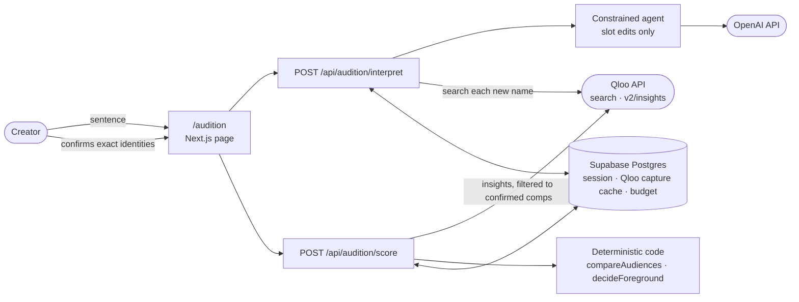

<div align="center">

<picture>
  <source media="(prefers-color-scheme: dark)" srcset="docs/brand/firstplayable-mark-dark.svg" />
  
</picture>

# FirstPlayable

**Choose the comps. Switch the audience. See what changes.**

[](https://firstplayable.vercel.app/audition)
[](https://firstplayable.vercel.app/audition?mode=live)
[](https://qloo.devpost.com/)

[](https://github.com/Asembris/FirstPlayable/actions/workflows/ci.yml)
[](LICENSE)

<a href="https://firstplayable.vercel.app/audition"></a>

<sub>The saved example at <a href="https://firstplayable.vercel.app/audition"><code>/audition</code></a>. Every title, artist and affinity in it is invented synthetic data, not Qloo data.</sub>

</div>

**FirstPlayable lets an indie game creator pick the movie and game comps that
represent their project, confirm each exact title in Qloo, and see how Qloo's
affinity data orders those same comps for two different music-artist audiences.
Deterministic code then says which confirmed comp has a clear lead for the
audience you pick, or that the top comps are too close to call.**

## The problem

Creators position a game through comps: *"it's Outer Wilds meets Arrival."*
But a list of comps is not neutral. The same three films can line up in a
different order depending on whose taste you condition on, and a creator
pitching to one audience may want to lead with a different comp than for
another. FirstPlayable makes that difference visible for the comps the creator
already chose, instead of leaving it to guesswork.

It is for **indie game creators** deciding how to frame a project. It is not a
general audience-research tool, a source of new comps, or marketing advice.

## The example: one comp list, two audiences

The saved example, *The Last Signal*, is an exploration game about decoding an
abandoned orbital station's final message. Its creator chose three movie comps
and three game comps, and two artist audiences. **All of these names and
numbers are invented** (see [Saved vs live](#saved-demonstration-vs-live-workflow)).

| Movie comp | Lanternfold fans | Juno Kestrel fans |
|---|---|---|
| Quiet Orbit | **1st** · 0.913 | 3rd · 0.701 |
| First Hello | 2nd · 0.846 | **1st** · 0.809 |
| Farther Than Light | 3rd · 0.830 | 2nd · 0.744 |

- **Switch the audience and the order changes.** Quiet Orbit leads for
  Lanternfold fans and falls to last for Juno Kestrel fans: Quiet Orbit /
  First Hello and Quiet Orbit / Farther Than Light are **reversed**.
- **Not every difference is a call.** First Hello / Farther Than Light is
  **close — no call**: for Lanternfold fans their gap is under 0.03.
- **The decision is bounded.** *"Which movie comp should I foreground for
  Lanternfold fans?"* → **Quiet Orbit is the clear lead among your confirmed
  movie comps**, because it beats every other scored movie comp by at least
  0.03. For Juno Kestrel fans the games section shows the other outcome:
  Courier of Ash and Starward Accord sit within 0.03 at the top, so the tool
  says **close at the top — no single lead** rather than picking one.

Movies and games are always ranked separately; a movie affinity is never set
against a game affinity.

## Who does what

| | Responsibility | What it can never do |
|---|---|---|
| **Creator** | Names comps and audiences in plain language, then **explicitly confirms every identity** from Qloo's search results. Nothing is scored until they pick the exact match | — |
| **Agent** (OpenAI model, constrained planner) | Turns the creator's sentence into bounded slot edits (add, remove, replace a movie comp, game comp or audience), maintains that task state across turns, asks one clarifying question when a title could be a movie or a game, and records a *foreground-decision question* when the creator asks one | See an affinity, score, rank or pick a winner. Its input is the sentence and the slot list; its output schema has no numeric field, no entity id and no answer field. It cannot confirm an entity or invent comps the creator did not name |
| **Qloo** | Search returns exact entity identities (title, year, id). Insights returns each confirmed comp's affinity **conditioned on a confirmed artist audience**, with the result set filtered to exactly the confirmed comps | Qloo does not choose the comps, rank them for the creator, or make the decision |
| **Deterministic code** | Sorts comps by returned affinity per audience, marks close pairs, finds reversals, and answers the foreground question from that same ranking with a fixed sentence template | It reports what the evidence shows under a fixed rule; it does not estimate demand, fit, or significance |

The agent's limits are enforced by construction (strict Zod schemas and a
reduced model input), not by prompt wording alone: see
[`src/server/audition/agent.ts`](src/server/audition/agent.ts). The comparison
is [`src/domain/audition-compare.ts`](src/domain/audition-compare.ts) and the
decision is [`src/domain/audition-decision.ts`](src/domain/audition-decision.ts).

### The rule behind every call

- **Clear lead:** the top comp beats every other scored comp in that domain by
  at least **0.03**.
- **Too close:** two or more comps sit within 0.03 of the top value. No leader
  is named.
- **Reversal:** comp X clearly beats Y for one audience and Y clearly beats X
  for the other. If either side is close, it is not a reversal.
- **Insufficient evidence:** no confirmed comps, only one scored comp, or no
  scores. No call is made.

The 0.03 threshold is a **product convention** chosen for readability. It is
not statistical significance and not a confidence value supplied by Qloo.

## Saved demonstration vs live workflow

| | Saved example — [`/audition`](https://firstplayable.vercel.app/audition) | Live — [`/audition?mode=live`](https://firstplayable.vercel.app/audition?mode=live) |
|---|---|---|
| Data | **Synthetic.** Invented titles, artists, entity ids, affinities and timestamps, written in Qloo's response shapes. Not Qloo data | **Real.** Live Qloo search and insights for the comps and audiences you confirm |
| Model | None. The decision question is fixed | Real OpenAI call to interpret each message |
| Provider calls | **Zero.** No session, database, Qloo or model call | One Qloo search per new name, then up to four insights requests (two domains × two audiences); responses are cached |
| Comparison and decision | The same deterministic functions as live | The same deterministic functions |

The saved example exists so judges can see the full result instantly and
offline. It shows how the product behaves, not what real audiences prefer. Its
full record, including every invented value and the deterministic call it
produces, is [`docs/AUDITION_CANONICAL_EXAMPLE.md`](docs/AUDITION_CANONICAL_EXAMPLE.md);
the fixture is [`fixtures/qloo/audition/`](fixtures/qloo/audition/), and
[`tests/server/audition-saved.test.ts`](tests/server/audition-saved.test.ts)
re-normalizes every synthetic response through the production normalizers.

## Judge demo (under 60 seconds)

1. Open **[firstplayable.vercel.app/audition](https://firstplayable.vercel.app/audition)**.
   It loads instantly, labelled *Saved example · synthetic demonstration data ·
   no live calls*.
2. Read the **Decision** block: *Which movie comp should I foreground for
   Lanternfold fans?* → *Quiet Orbit is the clear lead.*
3. Under **Movies**, compare the two columns: the same three comps, in a
   different order. Two pairs are marked **reversed**, one **close — no call**.
4. Press **Juno Kestrel fans**. The reading focus switches and each comp shows
   its position move (Quiet Orbit: *Position 1 → 3*).
5. Scroll to **Games**: Juno Kestrel fans get *Close at the top — no single
   lead*. The tool declines to call it.
6. Open **Synthetic evidence** under either domain to see the entities and the
   filtered request records behind the numbers.
7. *Optional, live:* press **Try your own** and type something like
   *"My game feels like Alien and Outer Wilds. Compare Radiohead fans and
   Kendrick Lamar fans. Which movie comp should I foreground for Radiohead
   fans?"* Confirm each match, then score. This makes real Qloo and model
   calls.

## Architecture



- **Two routes.** `interpret` turns a message into slot edits and runs the
  Qloo searches they need; `score` checks that every comp and audience was
  confirmed from a stored search capture, fetches insights, and runs the
  comparison and decision.
- **Two Qloo request shapes**, frozen in
  [`src/server/qloo/audition.ts`](src/server/qloo/audition.ts): a typed
  `search` and a `v2/insights` call with `signal.interests.entities` set to the
  audience and `filter.results.entities` set to the confirmed comps. A returned
  entity that was not requested fails the capture.
- **Server only.** The browser never calls Qloo, OpenAI or Supabase, and no
  credential is exposed to the client.
- **Bounded spend.** Model calls run under a hard cumulative cost cap and Qloo
  calls under a database-backed limiter; reaching either produces an explicit
  exhausted state, not a fallback.

| Concern | Choice |
|---|---|
| Application | Next.js 16 (App Router), React 19, TypeScript |
| Contracts | Zod 4; types are derived from the schemas |
| Cultural data | Qloo Hackathon API: entity search and `v2/insights` |
| Agent model | OpenAI `gpt-4o-mini-2024-07-18`, Structured Outputs, pinned |
| Persistence | Supabase Postgres (anonymous session, immutable capture cache, budget) |
| Hosting | Vercel |
| Tests | Vitest, Playwright (Chromium) |

## Limitations

- **Affinity is an audience signal, not a market.** An audience here is the
  fans of one music artist, as Qloo models them. It is not measured customer
  demographics, and a lead is not evidence of demand, sales lift, conversion,
  or project-to-audience fit.
- **It only compares comps the creator chose.** FirstPlayable does not
  recommend comps, and the concept description is creative framing; Qloo does
  not score the game itself.
- **Two audiences, up to four comps per domain.** Movies and games are never
  combined into one ranking.
- **The close rule is a convention.** 0.03 is chosen for readability, with no
  statistical meaning. Values near the threshold deserve judgment.
- **One decision type.** The agent can record *which comp to foreground for
  this audience*; other questions are out of scope.
- **The saved example is invented.** It demonstrates behaviour; its numbers
  say nothing about real titles or artists.
- **Anonymous and finite.** No accounts and no saved auditions: task state
  travels with each request. Live use stops when the model budget or Qloo
  allowance is exhausted.

## Run it locally

Requires Node `22.22.0` (see [`.nvmrc`](.nvmrc); `>=22.12` is accepted).

```bash
npm ci
```

```bash
npm run dev
```

Open `http://localhost:3000/audition`. The saved example needs **no account,
no credential and no network access** to any service.

The live workflow needs server-side credentials. Copy
[`.env.example`](.env.example) to `.env` and fill in:

| Variable | Needed for |
|---|---|
| `SUPABASE_URL`, `SUPABASE_SECRET_KEY` | Sessions, the Qloo capture cache and budgets (apply [`supabase/migrations/`](supabase/migrations/) first) |
| `QLOO_API_KEY`, `QLOO_API_BASE_URL` | Comp and artist search, and audience-conditioned insights |
| `OPENAI_API_KEY`, `OPENAI_CHAT_MODEL` | The agent that interprets creator messages |

No variable is `NEXT_PUBLIC_`; every credential stays on the server.

## Tests and validation

| Command | What it checks |
|---|---|
| `npm run typecheck` | `tsc --noEmit` over the repository |
| `npm test` | Vitest, offline: comparison and decision rules, the agent's schema boundary, Qloo normalization and exact-set filtering, route authority checks, the synthetic saved fixture, and the earlier product's engine |
| `npm run test:e2e` | Playwright, offline (builds first): the saved judge path with zero API calls, audience switching, mobile readability, the live session-readiness gate, ask → confirm → score with mocked routes, and the bounded decision. Run `npx playwright install chromium` once |
| `npm run check:fixtures` | Validates the bundled fixtures |
| `npm run build` then `npm run check:secrets` | Production build, then a credential-shape scan of tracked files and built assets |

CI runs all of the above on every push and pull request to `main` with no
repository secret. Commands that contact real services (`npm run smoke:*`,
`npm run verify:deployment`) are opt-in and refuse to run without an explicit
environment guard.

## Earlier prototype in this repository

FirstPlayable began as a playable-scene studio (influence approval, scene
compilation and a with/without comparison). That code still ships at
[`/difference`](https://firstplayable.vercel.app/difference) and
[`/studio`](https://firstplayable.vercel.app/studio) and is covered by the
test suite, but **it is not the submission**. Its records are in
[`docs/FIRSTPLAYABLE_BUILD_SPEC.md`](docs/FIRSTPLAYABLE_BUILD_SPEC.md),
[`docs/BUILD_STATUS.md`](docs/BUILD_STATUS.md) and
[`docs/PHASE6_CANONICAL_PAIR.md`](docs/PHASE6_CANONICAL_PAIR.md).

## Links

- Live product: [firstplayable.vercel.app](https://firstplayable.vercel.app)
- Saved audition: [firstplayable.vercel.app/audition](https://firstplayable.vercel.app/audition)
- Live audition: [firstplayable.vercel.app/audition?mode=live](https://firstplayable.vercel.app/audition?mode=live)
- Hackathon: [Qloo Agentic Hackathon on Devpost](https://qloo.devpost.com/)

## License

MIT. See [`LICENSE`](LICENSE).
