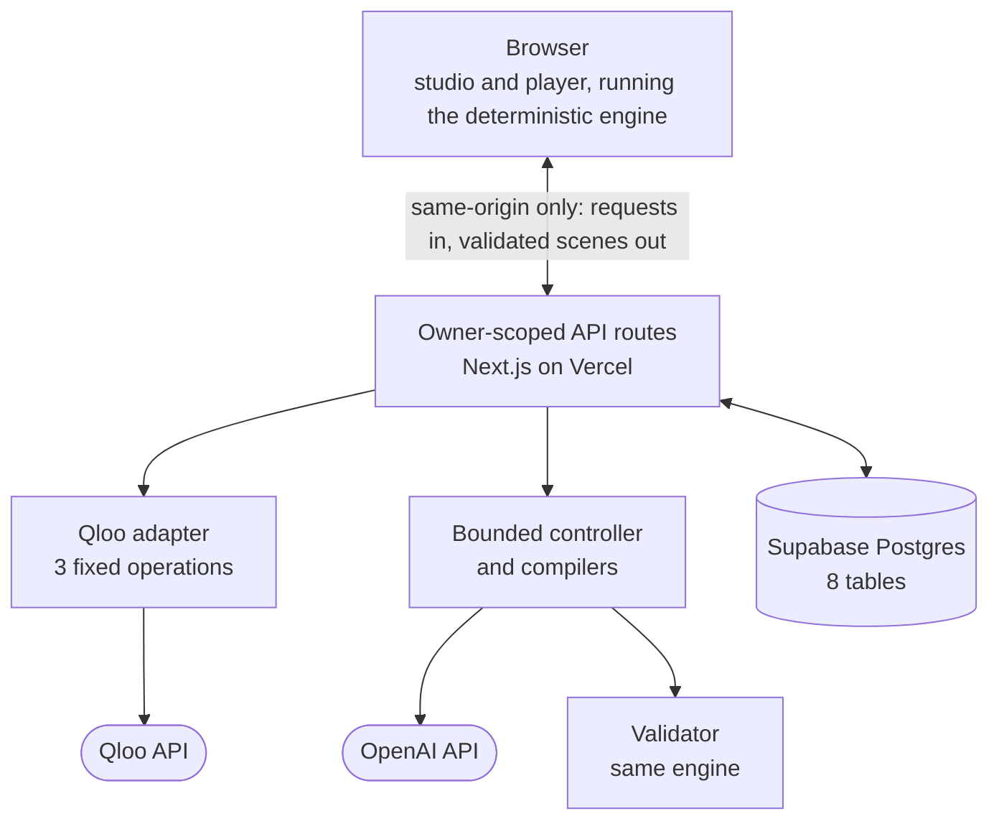
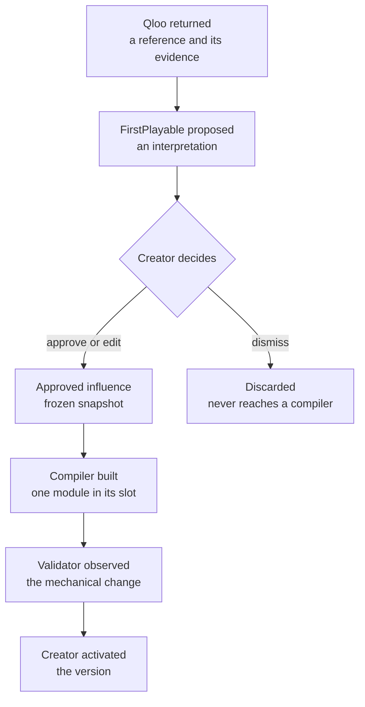
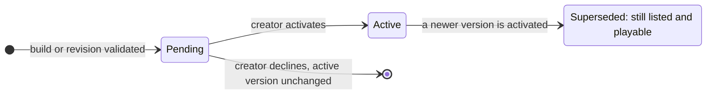

<div align="center">

<picture>
  <source media="(prefers-color-scheme: dark)" srcset="docs/brand/firstplayable-mark-dark.svg" />
  
</picture>

# FirstPlayable

*Choose the influences. Play the consequences.*

<a href="https://firstplayable.vercel.app/difference?view=compare"></a>

[](https://firstplayable.vercel.app)
[](https://firstplayable.vercel.app/difference?view=compare)
[](https://firstplayable.vercel.app/studio)
[](https://qloo.devpost.com/)

[](https://github.com/Asembris/FirstPlayable/actions/workflows/ci.yml)
[](LICENSE)

</div>

**FirstPlayable helps narrative-game creators test a cultural influence as a
playable scene variation before deciding whether to keep it.**

A creator discovers cultural material through Qloo, decides what one
interpretation of it should mean for an interaction, makes that interpretation
playable, and plays the scene with and without it — seeing exactly which
choices changed — before deciding what to keep. The payoff is the creator's
decision; the comparison shows its effect; the provenance shows where the
material and the interpretation came from.

## What FirstPlayable is

A small creative tool for pitching interactive scenes. A creator writes a
one-room brief, names an artist, and picks which of the artist's cultural
neighbours — real films and videogames returned by Qloo — should shape the
scene. FirstPlayable compiles only the approved influences into a validated,
deterministic, playable scene.

The product's one claim is narrow and checkable: **this approved influence
changed these choices in this scene.** The engine shows it by playing the same
choices with and without the influence and reporting what differs.

## A saved example: Lanternfold → Qloo → Halcyon Relay (synthetic demonstration)

The saved example is a synthetic deterministic demonstration built on a stored
build of a one-room scene, *The Second Copy*: a station attendant, a visitor
named Nia, and a sealed letter. The two scene versions, the creator's decision
and the diff are kept as stored. The Qloo layer is not real data: the artist,
the film, its evidence text and every Qloo identifier, fingerprint and
timestamp are invented stand-ins in Qloo's response shape, not a Qloo response.
The live creation path still uses real Qloo.

1. **The creator confirmed an artist:** Lanternfold (invented).
2. **Qloo returned**, in the synthetic stand-in, the invented film **Halcyon
   Relay** among Lanternfold's film neighbours, with descriptive evidence about
   identity and memory under isolation.
3. **FirstPlayable proposed** an interpretation about memory and identity,
   citing only that evidence.
4. **The creator edited and approved** a concrete version of it: the envelope
   is addressed to two names, and returning the letter stays locked until you
   ask Nia who the other name belongs to.
5. **The scene changed.** After the same two choices, *Return the letter* is
   open without Halcyon Relay and locked with it, and two new choices exist: **3
   changed, 3 unchanged**, in the same room with the same Nia and the same
   letter.

**▶ [Open the comparison](https://firstplayable.vercel.app/difference?view=compare)**
— saved from that build, no sign-in, nothing generated live. Its full record is
[`docs/PHASE6_CANONICAL_PAIR.md`](docs/PHASE6_CANONICAL_PAIR.md).

## How Qloo contributes

**Qloo helps determine which cultural material enters the experiment.
FirstPlayable helps the creator interpret it, make it playable, and decide what
to keep.**

| Step | Who | What they contribute |
|---|---|---|
| **Retrieve** | Qloo | The confirmed artist, and movie and videogame references conditioned on that artist, with their descriptive evidence |
| **Interpret** | FirstPlayable (model, bounded) | One proposed idea per reference, citing only evidence Qloo returned |
| **Decide** | The creator | Approve, edit, dismiss, or replace. Nothing is approved by default |
| **Compile** | FirstPlayable (model-selected, server-wired) | One module in the approved influence's own slot |
| **Verify** | Deterministic engine | A mechanical witness: what the influence changed, observed by replay |
| **Activate** | The creator | Nothing becomes current until they confirm it |

In this workflow, Qloo supplies the artist-conditioned film and videogame
references, together with the evidence and the stored source record behind
them. Removing Qloo removes this discovery source and the recorded
relationship:

- **The cross-domain step.** The creator starts from music and receives film
  and game references retrieved for that artist, rather than a model's
  unretrieved recall.
- **The evidence chain.** An approval must cite evidence ids that resolve
  inside the stored Qloo capture, with its entity ids and timestamps; the
  compiler payload refuses to build otherwise.
- **The first provenance layer.** "Qloo returned" is the root of every chain
  the creator and the judge can inspect.

What is **not** claimed: that Qloo generated the mechanic, rated a reference,
knows a creator's taste, or makes the story objectively better; that a language
model could not name a real film, or another catalogue could not hold the same
works; or that the with / without comparison shows superiority over a model
working alone. Qloo's returned affinity is kept private and is never shown as
creative confidence.

## Judge demo path

Steps 1–5 are the saved proof: about a minute, no account, and nothing
generated live. Step 6 is optional and uses the live creation path.

| # | Do this | What it shows |
|---|---|---|
| 1 | Open [the landing page](https://firstplayable.vercel.app) and press **Play the difference** | A saved example, labelled as a synthetic demonstration |
| 2 | Watch the scene open at the recorded point, then split into **Compare** by itself | The same room, Nia, and letter after the same two choices: **3 changed, 3 unchanged** |
| 3 | Read the changed rows | Without Halcyon Relay, *Return the letter* is open. With it, it is locked, and two new choices exist |
| 4 | Open a mark to read the causal note | The four stored layers: Qloo returned → proposed → creator approved → scene changed |
| 5 | Press **Continue without**, or play on with Halcyon Relay | Both sides are fully playable; with it, both requirements unlock Return, which ends the scene |
| 6 | *Optional, live:* go back and press **Create your scene** | The real path: brief → artist → influences → build → review. It makes live Qloo and model calls |

Keyboard: <kbd>P</kbd> / <kbd>C</kbd> switch Play and Compare, <kbd>W</kbd> /
<kbd>O</kbd> switch versions; single-key shortcuts can be turned off.

The saved example is bundled from the two stored versions and their
provenance record in
[`docs/phase6-canonical-pair/`](docs/phase6-canonical-pair/), so it plays with
no database, model, or Qloo call. Its full record, including the two rejected
candidates, is [`docs/PHASE6_CANONICAL_PAIR.md`](docs/PHASE6_CANONICAL_PAIR.md).

## How it works

1. **Brief.** A one-room premise: a character, an object, and a fixed set of
   choices. It is frozen before anything is generated.
2. **Artist.** The creator searches Qloo and explicitly confirms one identity.
   The first search result is never assumed.
3. **References.** Two Qloo requests return movie and videogame neighbours of
   the confirmed artist. Each is normalized into evidence items and stored.
4. **Proposals.** One bounded model call proposes interpretations for up to
   six usable references. Each must cite only its own reference's evidence, or
   the whole set is rejected.
5. **Approval.** The creator approves, edits, dismisses, or replaces. At most
   one influence per slot: *Discovery* and *Commitment*.
6. **Build.** The server compiles a clean base and one module per approved
   influence, validates every candidate, and stores a version as *pending*.
7. **Review and activate.** The creator plays the pending version, sees what
   each influence was intended to do beside what the engine observed, and
   activates it — or does not.
8. **Revise, share, export.** Targeted revisions, read-only share links, and a
   one-file offline export, all described below.

A normal uncached creation costs **three** Qloo calls: one search and two
first-hop requests. Compilation, activation, and playthrough cost **zero**.

## Architecture



| Layer | Responsibility |
|---|---|
| `src/domain/`, `src/engine/` | Zod contracts and the pure engine: interpreter, composer, validator, diff, canonical hashing. No React, Next.js, server, or configuration dependency |
| `src/components/` | The studio, the rehearsal table (`/` and `/difference`), the public player, and the trusted scene player |
| `src/server/qloo/` | Three frozen operations, normalization, cache, and a database-backed launch limiter |
| `src/server/influence/` | The context firewall, the proposal stage, creator decisions, provenance |
| `src/server/compile/` | Isolated payload builders, the base and module compilers, the bounded controller |
| `src/server/revision/`, `src/server/publish/`, `src/export/` | Targeted revision, immutable sharing, offline export |
| `src/app/` | Next.js App Router pages and seventeen API routes |
| `supabase/migrations/` | Eight tables, their access posture, and the atomic functions |

The browser never calls Qloo, OpenAI, or Supabase. Every credential is server
only; no `NEXT_PUBLIC_` variable exists in the repository. The same engine runs
in the browser player, the server validator, the tests, the fixture checker,
and the exported HTML file — there is no second, simplified engine.

## Approval and provenance

Approval is the boundary between what Qloo returned and what the scene may
contain.



| Rule | How it is enforced |
|---|---|
| Nothing is approved by default | Approvals are written only by an explicit creator decision, through one database function |
| Only approved influences reach the compiler | The module payload is built from one approval and its own cited evidence. Dismissed, unselected, and other-slot material is unreachable, proven with planted sentinel strings |
| Editing never rewrites evidence | The creator's wording is stored beside the frozen proposal; capture and decision rows reject `UPDATE` |
| Evidence can only narrow | An approval may cite fewer of the proposal's evidence ids, never one outside them |
| History is append-only | Replacements and removals add rows and keep their predecessors |
| "Scene changed" cannot be faked | That layer is rendered only from a witness the engine computed on the stored version, never from model or creator text |

The UI says *Qloo returned*, *FirstPlayable proposed*, *Creator approved*. A
browser test and the deployed verifier both scan for affinity, confidence,
percentages, and phrases like "Qloo recommends" — and fail if they appear.

The isolation guarantee is **dataflow and ownership isolation**. It is not a
claim about what a language model could independently invent from the brief.

## Deterministic compilation and validation

The line between what the server owns and what the model may choose is the
core of the design.

| | Server-owned, deterministic | Model-selected, schema-bounded |
|---|---|---|
| **Base scene** | State variables, the six actions with their verbs, targets and conditions, one branch per action, the three endings, the attachment ports | Title, action labels, dialogue, ending text |
| **Influence module** | Identifiers, the flag and its initial value, the condition that offers the action, the effect that sets the flag, the gate on the earned base action, the port it attaches to | How many mechanics (one to three), `inspect` or `ask`, which base action each gates, whether its flag is shown, all copy |
| **Validation** | Schema, authority, and exhaustive reachable-state analysis; every subset of modules; the mechanical witness; the revision diff | — |
| **Gameplay** | Every step, ending, and reset | — |

A module therefore **cannot** write the foundation's state, read the other
slot's state, end the scene, or attach to a port that is not its own. These are
not rejected values; the schema gives the model nowhere to express them.

**What the validator checks**, on every candidate:

- Every reachable state has exactly one applicable branch per enabled action,
  and every non-terminal step makes progress.
- No soft-lock: every reachable state can still reach an ending.
- At least one non-terminal choice narrows which endings remain reachable.
- Each approved module has an observable **mechanical witness** when present
  versus absent — an action that changes availability, or an ending that
  changes reachability — found by bounded paired-state replay.
- The base alone, each module alone, and both together are all valid, so a
  later removal is always safe.

**Bounded generation.** The pinned model is `gpt-4o-mini-2024-07-18` through
Structured Outputs. Each stage gets one attempt and at most one repair. A
rejected candidate lives only in a bounded operation record; only a validated
scene becomes a version, which the database enforces as well as the
application. Model spend is held under a hard cumulative **$0.60** cap in one
Postgres row; reaching it is an honest exhausted-budget state, never a fallback.

## Versions, revision, sharing, and export



Every version is immutable. A failed build or a declined review leaves the
previously active version active and playable.

| Capability | Behaviour | Provider calls |
|---|---|---|
| **Remove an influence** | Recomposes without that slot's module and stores the diff, labelled `mechanical` or `wording` | **0** |
| **Edit or replace an influence** | Changes one approval; the next build recompiles only that slot and reuses the base and the other slot by input hash | Only the rebuilt slot's module |
| **Reword an ending** | Previewed with one text-only call; applied only if the creator applies exactly the previewed text | 1 for the preview, 0 to apply |
| **Compare versions** | Same choices replayed on both; the stored diff must equal the engine's recomputation | **0** |
| **Share** | Previewed, then published as a read-only link pinned to one version. The public payload is a whitelisted snapshot with no project id, premise, owner data, capture, or unapproved idea. Revocation takes effect on the next read | **0** |
| **Export** | One self-contained HTML file, owner only. It plays from `file://` with the network blocked and makes no request of any kind | **0** |

Gameplay is local: a complete playthrough, every ending, and a reset make
**zero** requests.

## Verification and production evidence

[](https://firstplayable.vercel.app)
[](#commands)
[](#commands)
[](.nvmrc)

Production at [firstplayable.vercel.app](https://firstplayable.vercel.app) is
built from the final submission commit
[`e44ab20`](https://github.com/Asembris/FirstPlayable/commit/e44ab202d8a84db33e5679b3b340614c748ada70).
Its application code is the Phase 6 frozen build (`f15ed67`) plus judge-facing
copy only; the engine, compiler, schemas, model, and Qloo layer are unchanged.

| Gate | Result |
|---|---|
| Deployed verifier against production (`npm run verify:deployment`) | **118 / 118 PASS** |
| Judge path on production, end to end | **Verified** |
| Unit tests (`npm test`, Vitest) | **767 PASS** |
| Browser tests (`npm run test:e2e`, Playwright) | **134 PASS** |
| CI on every pull request and push to `main` | Typecheck, unit tests, fixtures, build, secret scan, browser gate — with no repository secret |
| Security and CodeQL on every push to `main` | Full-history TruffleHog scan, dependency audit, and CodeQL for JavaScript/TypeScript and workflows |

The deployed verifier drives the real application over HTTP and in a real
browser. Among its checks:

| Area | What it establishes on the live deployment |
|---|---|
| Ownership and security | A fresh non-owner session is refused (`404`), no session is refused (`401`); mutation-security refusals hold |
| Qloo workflow | Artist confirmation, retrieval, proposals, and creator decisions over HTTP and in a browser |
| Compilation | Build, review, activation, and a playthrough that makes zero requests |
| Revision | Edit, replace, ending-copy preview and apply, a forged apply refused, remove; every stored diff equals the engine's recomputation |
| Sharing | Publish → read from a fresh browser → revoke → the next read is `404`; no private data in the public payload |
| Export | Owner-only; plays from `file://` offline with zero requests |
| Isolation | The browser reaches only its own origin — never OpenAI, Qloo, or Supabase; no credential shape or provider host in client chunks |

The canonical pair was re-verified independently after it was stored: same
project and parent link, identical `world` / `core` / `ports` hashes, only the
Discovery module differs, the stored diff equals the recomputed diff, both
versions validate, all three endings stay reachable with no soft-lock in each.
The full table is in [`docs/PHASE6_CANONICAL_PAIR.md`](docs/PHASE6_CANONICAL_PAIR.md).

## Tech stack

| Concern | Choice |
|---|---|
| Application | Next.js 16 (App Router), React 19, TypeScript 7 |
| Contracts | Zod 4 — types are derived from the schemas; there is no second validator |
| Persistence | Supabase Postgres: eight tables, atomic SQL functions, compare-and-swap writes |
| Cultural data | Qloo Hackathon API: artist search and two `v2/insights` requests |
| Model | OpenAI `gpt-4o-mini-2024-07-18`, Structured Outputs, pinned |
| Hosting | Vercel |
| Tests | Vitest, Playwright (Chromium) |
| Runtime | Node `22.22.0` (`.nvmrc`); dependencies pinned exactly and locked |

No agent framework, vector store, queue, or second service: one bounded
controller and eight tables.

## Quickstart

Once dependencies are installed, the engine, the saved examples, the tests,
and the production build need **no account, no credential, and no network
access to any application service**.

```bash
npm ci
```

```bash
npm run dev
```

Then open `http://localhost:3000/difference` for the saved pair (a synthetic demonstration), or
`/example` for the hand-authored Phase 1 fixture.

The persistent studio needs credentials. Copy [`.env.example`](.env.example) to
`.env`; every variable is server only.

| Variable | Needed for |
|---|---|
| `SUPABASE_URL`, `SUPABASE_SECRET_KEY` | The persistent studio and `npm run smoke:supabase` |
| `SUPABASE_ACCESS_TOKEN` | The Supabase CLI only; never read by the application |
| `QLOO_API_KEY`, `QLOO_API_BASE_URL` | Artist search and the two first-hop reference requests |
| `OPENAI_API_KEY`, `OPENAI_CHAT_MODEL` | The proposal stage and the base and module compilers |
| `QLOO_*` safety knobs (optional) | Tighten the launch gap, the lease ceiling, or the local allowance |
| `MODEL_COST_CAP_MICROS` (optional) | Lower the cumulative spend cap below its compiled-in $0.60 |

## Commands

| Command | What it does |
|---|---|
| `npm run dev` | Local development server |
| `npm run build` / `npm start` | Production build (no database needed) and serve it |
| `npm run typecheck` | `tsc --noEmit` over the repository |
| `npm test` | Vitest: contracts, engine, Qloo normalization and transport, proposal boundary, creator decisions, influence isolation, compilers, controller, revision, publication, export, route security, SQL surface. Offline |
| `npm run test:e2e` | Playwright: the judge path, studio, approval, build and review, revision, sharing, contrast, keyboard, reduced motion, mobile. Offline; run `npx playwright install chromium` once first |
| `npm run check:fixtures` | Validate every fixture and print the canonical Phase 1 evidence |
| `npm run check:secrets` | Scan tracked files and built assets for credential shapes; run after `npm run build` |

**Opt-in commands that contact real services.** Each refuses to run without its
guard, and none is a dependency of `npm test` or `npm run build`.

| Command | Guard |
|---|---|
| `npm run smoke:supabase` | `RUN_SUPABASE_SMOKE=1` |
| `npm run smoke:openai` | `RUN_OPENAI_SMOKE=1` — one tiny real call |
| `npm run smoke:qloo` | `RUN_QLOO_SMOKE=1` — three real Qloo calls when uncached, zero when cached |
| `npm run smoke:proposal` | `RUN_PROPOSAL_SMOKE=1` — one real model call and one real approval |
| `npm run smoke:compile` | `RUN_PHASE4_SMOKE=1` — full compilation through the real route handlers; writes real versions |
| `npm run verify:deployment` | `RUN_DEPLOY_VERIFY=1` and `DEPLOY_URL=https://…` |

## Limitations and honest boundaries

- **A deliberately small form.** One room, one character, one object, a closed
  action vocabulary, two influence slots, three endings. It is a pitch tool,
  not a game engine.
- **The comparison is an ablation, not a contest.** "Without this influence"
  answers *what did this approved influence contribute here?* It is not
  evidence that Qloo produces better games. The specification's optional
  no-Qloo, model-selected comparator was **not built**, so no comparative
  quality claim is made.
- **The validator proves structure, not taste.** It does not judge writing,
  faithfulness to the reference, originality, or emotional effect.
- **Isolation is dataflow isolation.** A model could still arrive at a similar
  idea from the brief alone; no test claims otherwise.
- **The saved pair has known seams**, recorded rather than hidden: the Discovery
  module added two requirements, not one; the base text calls the envelope
  "unmarked" before Nia mentions the other name; and the "other name" question
  is offered from the start. Changing any of them would mean a new compile and
  a new pair.
- **Ending wording is generated, then chosen.** A creator applies previewed
  text; they cannot type an arbitrary ending.
- **Anonymous ownership.** A project belongs to one `HttpOnly` session cookie,
  stored only as a hash. There is no account and no recovery: losing the cookie
  loses editing access.
- **Finite budget.** Model spend is capped at a cumulative $0.60 that does not
  reset. Reaching it shows an exhausted-budget state; there is no paid
  fallback. Qloo usage is bounded by a database-backed limiter.
- **Evidence of working, not of reliability.** Production verification is a
  passing end-to-end run, not an uptime or load measurement. Third-party
  outages produce a finished error state, not a guarantee of availability.

## Supporting evidence

| Document | Contents |
|---|---|
| [`docs/FIRSTPLAYABLE_BUILD_SPEC.md`](docs/FIRSTPLAYABLE_BUILD_SPEC.md) | The authoritative specification: scene schema, validation, Qloo layer, isolation, revision semantics, non-goals |
| [`docs/BUILD_STATUS.md`](docs/BUILD_STATUS.md) | The append-only build and verification record for every phase, including failures |
| [`docs/PHASE6_CANONICAL_PAIR.md`](docs/PHASE6_CANONICAL_PAIR.md) | The saved pair (synthetic demonstration): identifiers, provenance, diff, independent re-verification, caveats, and the rejected candidates |
| [`docs/phase6-canonical-pair/`](docs/phase6-canonical-pair/) | The two stored versions and their provenance record, from which the judge path is built |
| [`docs/PHASE3_QLOO_EVIDENCE.md`](docs/PHASE3_QLOO_EVIDENCE.md) | The exact Qloo requests, field mappings, live captures, cache policy, proposal boundary, isolation sentinels |
| [`docs/PHASE4_EVIDENCE.md`](docs/PHASE4_EVIDENCE.md) | Compilation evidence, including every failed attempt |
| [`docs/DEPLOYMENT_PREFLIGHT.md`](docs/DEPLOYMENT_PREFLIGHT.md) | External accounts, migrations, deployments, and deployed verification runs |

## License

MIT. See [`LICENSE`](LICENSE).
